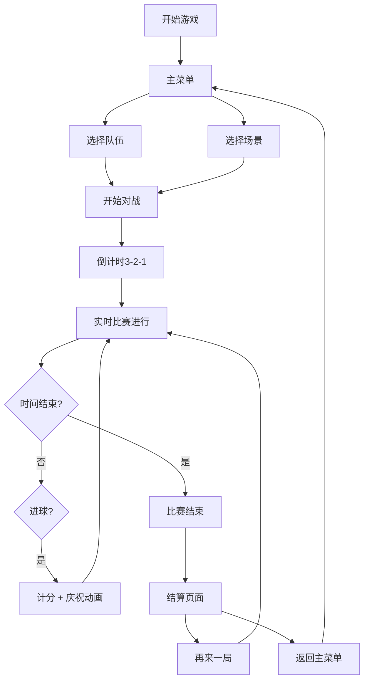

## 1. 产品概述

《热血篮球》是一款四人制（2v2）街头篮球对抗游戏，延续热血系列夸张逗趣的像素风格，玩家操控圆脑袋小短腿的不良少年，在各种特色球场展开混乱搞笑的篮球对决。

- 核心玩法：无规则街头篮球，飞踹、盖帽、扣碎篮板无所不能
- 目标用户：喜欢热血系列、街头篮球、多人对战游戏的玩家
- 产品特色：夸张的物理效果、搞笑的角色动作、丰富的必杀技系统、多样化的场景互动

## 2. 核心功能

### 2.1 用户角色

| 角色 | 操作方式 | 核心权限 |
|------|----------|----------|
| 玩家1 | 键盘WASD + J/K/L | 控制红队球员1 |
| 玩家2 | 键盘方向键 + 1/2/3 | 控制蓝队球员1 |
| AI队友 | 自动控制 | 协助玩家控制的球队 |

### 2.2 功能模块

1. **主菜单页面**：游戏标题、开始游戏、选择队伍、场景选择、操作说明
2. **游戏对战页面**：2v2实时对战、计分板、必杀槽、暂停菜单
3. **结算页面**：比赛结果、数据统计、重新开始、返回菜单

### 2.3 页面详情

| 页面名称 | 模块名称 | 功能描述 |
|-----------|-------------|---------------------|
| 主菜单 | 标题区域 | 像素风格游戏LOGO，动态燃烧篮球特效 |
| 主菜单 | 队伍选择 | 选择红队/蓝队，自定义队伍颜色 |
| 主菜单 | 场景选择 | 海滨球场/街头球场/高速公路球场切换预览 |
| 主菜单 | 操作说明 | 按键布局图，技能说明 |
| 游戏对战 | 球场渲染 | 2D像素球场，动态背景，场景特效 |
| 游戏对战 | 角色系统 | 4名球员实时控制，跑、跳、传球、投篮、必杀技 |
| 游戏对战 | 物理系统 | 重力、碰撞、反弹、击飞效果 |
| 游戏对战 | 道具系统 | 场地上随机掉落道具，拾取获得临时增益 |
| 游戏对战 | UI界面 | 计分板、时间、必杀槽、队员状态 |
| 结算页面 | 结果展示 | 比分展示，MVP评选，搞笑动画 |
| 结算页面 | 操作按钮 | 再来一局、返回主菜单 |

## 3. 核心流程

**核心游戏流程说明：**
1. 玩家进入主菜单，选择操控队伍和比赛场景
2. 比赛开始前3秒倒计时，球员站位
3. 比赛正式开始，双方争抢跳球
4. 球员可以带球跑动、传球、投篮、使用道具
5. 蓄力满后可释放必杀技，造成夸张效果
6. 进球后计分，球权转换，比赛继续
7. 时间结束后显示结算页面，可选择重开或返回菜单

## 4. 用户界面设计

### 4.1 设计风格

- **主色调**：热血红 (#FF4444)、活力橙 (#FF8800)、篮球橙 (#FFAA33)
- **辅助色**：天空蓝 (#44AAFF)、草地绿 (#44CC44)、像素黑 (#222222)
- **字体**：像素风格字体 (Press Start 2P / Zpix)，大字号粗体标题
- **按钮风格**：3D像素立体按钮，按下时有凹陷效果，悬停有发光描边
- **布局风格**：复古街机风格，像素边框，CRT扫描线滤镜
- **图标风格**：8-bit像素画风格，使用emoji和像素图标结合

### 4.2 页面设计概述

| 页面名称 | 模块名称 | UI元素 |
|-----------|-------------|-------------|
| 主菜单 | 标题区域 | 像素LOGO，燃烧篮球动画，背景是动态像素篮球场 |
| 主菜单 | 选择区域 | 卡片式队伍/场景选择，选中时有放大发光效果 |
| 主菜单 | 操作说明 | 像素风格键盘布局图，按键有按下动画 |
| 游戏对战 | 球场区域 | 2D横向视角，像素渲染的球场和球员，动态阴影 |
| 游戏对战 | 顶部UI | 左右两侧队伍计分板，中间倒计时，数字跳动特效 |
| 游戏对战 | 底部UI | 玩家必杀槽，蓄力时发光，满槽时燃烧特效 |
| 游戏对战 | 特效层 | 扣篮火焰、击飞星星、必杀技全屏特效 |
| 结算页面 | 结果展示 | 大号像素比分，MVP角色跳出来耍帅 |
| 结算页面 | 按钮区域 | 闪烁的"再来一局"按钮，像素箭头指示 |

### 4.3 动画效果设计

| 动画名称 | 效果描述 |
|-----------|-------------|
| 角色跑动 | 腿部快速摆动呈轮子状，身体上下颠簸 |
| 被扇飞 | 在空中旋转3圈，然后脑袋插进地面 |
| 扣篮瞬间 | 篮筐冒火，篮板碎裂，屏幕震动 |
| 必杀技释放 | 画面闪光，角色摆出POSE，球化作特效飞行 |
| 计分跳动 | 数字快速跳动，冒烟雾特效 |
| 道具拾取 | 角色头顶冒出感叹号，身上环绕对应颜色光效 |

### 4.4 响应式

- 桌面端：1280x720 固定分辨率，Canvas居中显示
- 窗口大小变化：保持16:9比例自适应，添加像素完美缩放
- 移动端（可选）：虚拟摇杆和按钮，但本版本优先桌面端

## 5. 游戏核心玩法设计

### 5.1 操作控制

| 按键 | 玩家1 (红队) | 玩家2 (蓝队) | 功能 |
|------|-------------|-------------|------|
| 移动 | W/A/S/D | ↑/←/↓/→ | 控制球员移动 |
| 跳跃 | K | 2 | 跳跃，可盖帽抢篮板 |
| 传球/抢断 | J | 1 | 持球时传球，防守时抢断/飞踹 |
| 投篮/必杀 | L | 3 | 持球时投篮，满槽时释放必杀技 |

### 5.2 球员属性

| 属性 | 说明 |
|------|------|
| 速度 | 移动速度，影响跑动和突破 |
| 力量 | 影响撞人、盖帽击飞距离 |
| 弹跳 | 跳跃高度，影响抢篮板和盖帽 |
| 精准 | 投篮命中率 |
| 必杀槽 | 跑动、传球、运球时积累，满槽可放必杀 |

### 5.3 必杀技系统

| 必杀技类型 | 效果描述 |
|-----------|-------------|
| 燃烧流星 | 球化作燃烧的流星，从三分线外直轰篮筐，无法被盖帽 |
| 龙卷风暴 | 球旋转成龙卷风，把防守者全部卷上天再落入网中 |
| 暴力灌篮 | 跳到高空翻滚数圈，垂直砸下连人带球一起灌入篮筐 |
| 空中拦截 | 防守必杀，跳得比篮板还高把必杀投篮直接空中拦截 |
| 双臂格挡 | 力量型防守必杀，用双臂格挡把球弹飞 |
| 双人连携 | 一人跳到空中接另一人抛传，直接凌空扣篮，屏幕震动 |

### 5.4 场景特色

| 场景名称 | 特色机制 |
|-----------|-------------|
| 海滨球场 | 沙滩区域会陷脚，跑动速度降低30% |
| 街头球场 | 铁丝网带电，碰到会被弹开并短暂眩晕 |
| 高速公路球场 | 偶尔有大卡车冲过来，把场上所有人撞飞，球掉进车厢需要追车捡球 |

### 5.5 道具系统

| 道具名称 | 效果描述 | 持续时间 |
|-----------|-------------|----------|
| 加速鞋带 | 移动速度+50% | 10秒 |
| 弹跳饮料 | 跳跃高度+80% | 8秒 |
| 磁铁手套 | 抢断范围变大，自动吸附附近的球 | 12秒 |
| 平底锅盖 | 盖帽范围和力量大幅提升 | 6秒 |
| 香蕉皮 | 放置陷阱，踩到的球员会滑倒 | 直到被踩 |
