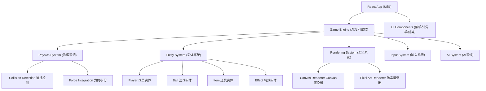

## 1. 架构设计



## 2. 技术描述

- **前端框架**: React 18 + TypeScript + Vite
- **样式方案**: TailwindCSS 3
- **游戏渲染**: HTML5 Canvas 2D API，像素完美渲染
- **游戏循环**: requestAnimationFrame + 固定时间步长 (60fps)
- **状态管理**: React useState/useReducer + 自定义游戏状态管理
- **像素字体**: Press Start 2P (Google Fonts)
- **无后端**: 纯前端游戏，所有逻辑在客户端运行

## 3. 目录结构

```
src/
├── components/              # React UI组件
│   ├── MainMenu.tsx         # 主菜单
│   ├── GameCanvas.tsx       # 游戏Canvas容器
│   ├── ScoreBoard.tsx       # 计分板
│   ├── SpecialBar.tsx       # 必杀槽UI
│   ├── Controls.tsx         # 操作说明
│   └── GameOver.tsx         # 结算页面
├── game/                    # 游戏核心逻辑
│   ├── engine/
│   │   ├── GameEngine.ts    # 游戏主引擎
│   │   ├── GameLoop.ts      # 游戏循环
│   │   └── GameState.ts     # 游戏状态管理
│   ├── physics/
│   │   ├── Physics.ts       # 物理引擎
│   │   ├── Collision.ts     # 碰撞检测
│   │   └── Vector2.ts       # 2D向量类
│   ├── entities/
│   │   ├── Entity.ts        # 实体基类
│   │   ├── Player.ts        # 球员实体
│   │   ├── Ball.ts          # 篮球实体
│   │   ├── Item.ts          # 道具实体
│   │   ├── Hoop.ts          # 篮筐实体
│   │   └── Effect.ts        # 特效实体
│   ├── rendering/
│   │   ├── Renderer.ts      # 渲染器基类
│   │   ├── PlayerRenderer.ts # 球员渲染
│   │   ├── CourtRenderer.ts # 球场渲染
│   │   └── EffectRenderer.ts # 特效渲染
│   ├── systems/
│   │   ├── InputSystem.ts   # 输入系统
│   │   ├── AISystem.ts      # AI系统
│   │   ├── SpecialSystem.ts # 必杀技系统
│   │   └── ItemSystem.ts    # 道具系统
│   └── courts/
│       ├── Court.ts         # 球场基类
│       ├── BeachCourt.ts    # 海滨球场
│       ├── StreetCourt.ts   # 街头球场
│       └── HighwayCourt.ts  # 高速公路球场
├── types/
│   └── game.ts              # TypeScript类型定义
├── hooks/
│   └── useGameLoop.ts       # 游戏循环Hook
├── utils/
│   ├── pixel.ts             # 像素绘制工具
│   └── animation.ts         # 动画工具
├── App.tsx
├── main.tsx
└── index.css
```

## 4. 路由定义

| 路由 | 页面 | 说明 |
|-------|------|------|
| / | MainMenu | 主菜单页面 |
| /game | GameCanvas | 游戏对战页面 |
| /gameover | GameOver | 结算页面 |

## 5. 核心数据结构

### 5.1 游戏状态类型

```typescript
type GamePhase = 'menu' | 'countdown' | 'playing' | 'paused' | 'gameover';

interface GameState {
  phase: GamePhase;
  time: number;
  maxTime: number;
  score: {
    red: number;
    blue: number;
  };
  countdown: number;
  selectedCourt: string;
  selectedTeam: 'red' | 'blue';
}
```

### 5.2 球员属性

```typescript
interface PlayerStats {
  speed: number;
  strength: number;
  jump: number;
  accuracy: number;
}

interface PlayerState {
  id: string;
  team: 'red' | 'blue';
  position: Vector2;
  velocity: Vector2;
  stats: PlayerStats;
  specialGauge: number;
  isAI: boolean;
  isJumping: boolean;
  isKnockedOut: boolean;
  hasBall: boolean;
  currentItem: ItemType | null;
  animation: PlayerAnimation;
}
```

### 5.3 篮球状态

```typescript
interface BallState {
  position: Vector2;
  velocity: Vector2;
  isHeld: boolean;
  holderId: string | null;
  isSpecialShot: boolean;
  specialType: SpecialType | null;
  rotation: number;
}
```

### 5.4 道具类型

```typescript
type ItemType = 'speed' | 'jump' | 'magnet' | 'pan' | 'banana';

interface ItemState {
  id: string;
  type: ItemType;
  position: Vector2;
  isPickedUp: boolean;
  duration: number;
}
```

## 6. 核心算法

### 6.1 物理引擎

- **重力**: 每帧施加向下的重力加速度 (0.5px/frame²)
- **碰撞检测**: AABB矩形碰撞 + 圆形碰撞
- **反弹系数**: 地面0.6，篮板0.8，篮筐0.3
- **摩擦力**: 地面0.92，空中0.99

### 6.2 投篮轨迹计算

```typescript
function calculateShotTrajectory(
  startPos: Vector2,
  targetPos: Vector2,
  power: number
): Vector2 {
  const dx = targetPos.x - startPos.x;
  const dy = targetPos.y - startPos.y;
  const distance = Math.sqrt(dx * dx + dy * dy);
  const angle = Math.atan2(dy, dx) + (power * 0.3);
  const speed = 8 + power * 6;
  return new Vector2(
    Math.cos(angle) * speed,
    Math.sin(angle) * speed - 5
  );
}
```

### 6.3 AI决策树

```typescript
function aiDecision(player: Player, gameState: GameState): Action {
  if (player.hasBall) {
    if (isNearHoop(player)) return Action.SHOOT;
    if (isDefenderNear(player)) return Action.PASS;
    return Action.MOVE_TO_HOOP;
  } else {
    if (ball.isHeld && ball.holder?.team !== player.team) {
      return Action.STEAL;
    }
    if (isNearBall(player)) return Action.GET_BALL;
    return Action.GET_OPEN;
  }
}
```

## 7. 性能优化

- **对象池**: 特效、粒子使用对象池复用，避免频繁GC
- **空间分区**: 使用网格分区减少碰撞检测数量
- **渲染优化**: 离屏Canvas预渲染静态元素（球场、篮筐）
- **状态更新**: 仅在必要时更新React UI，游戏逻辑与UI分离
- **像素完美**: 禁用Canvas抗锯齿，使用整数坐标绘制

## 8. 配置常量

```typescript
// 游戏配置
const GAME_CONFIG = {
  WIDTH: 1280,
  HEIGHT: 720,
  FPS: 60,
  MATCH_TIME: 180, // 3分钟
  MAX_SPECIAL: 100,
  GRAVITY: 0.5,
  GROUND_Y: 600,
};

// 球场配置
const COURT_CONFIG = {
  LEFT_HOOP_X: 150,
  RIGHT_HOOP_X: 1130,
  HOOP_Y: 280,
  THREE_POINT_LINE: 350,
  CENTER_X: 640,
};

// 球员配置
const PLAYER_CONFIG = {
  WIDTH: 40,
  HEIGHT: 60,
  BASE_SPEED: 4,
  BASE_JUMP: 12,
  KNOCKOUT_TIME: 60, // 1秒
};
```
