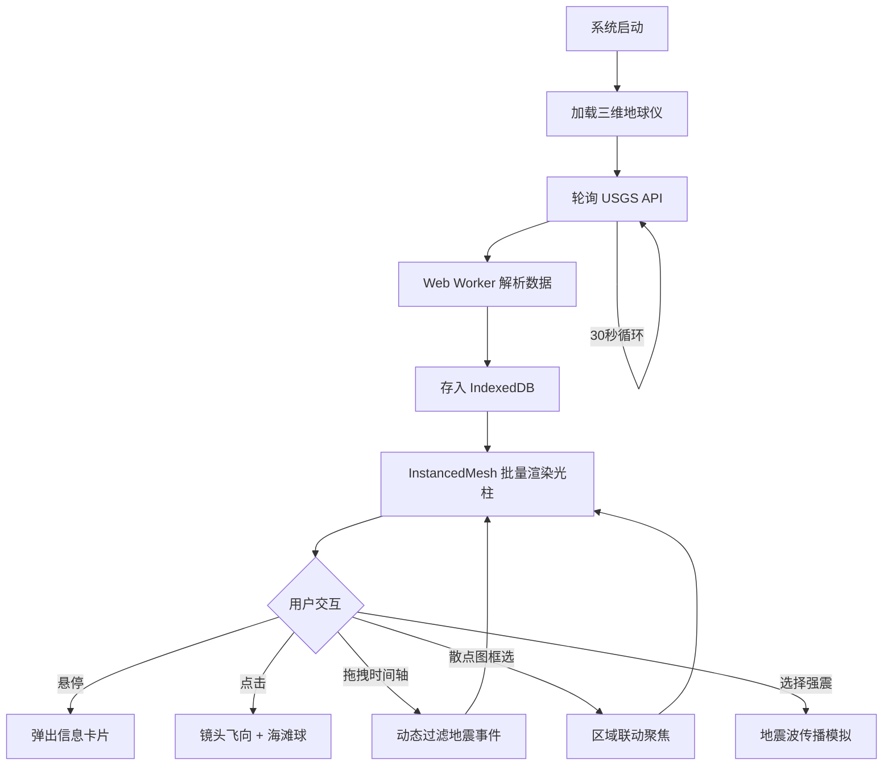

## 1. 产品概述

全球地震活动实时监测与分析3D可视化系统——一个运行在浏览器端的沉浸式地球科学可视化平台，将USGS实时地震数据以脉冲光柱的形式呈现在三维地球仪上，结合时序分析、震源机制解展示和地震波传播模拟，让用户直观感受地球深处的脉动。

- 目标用户：地震学研究者、地质爱好者、应急管理人员、科学教育工作者
- 核心价值：将抽象的地震数据转化为可交互的三维视觉体验，实现数据驱动的地震活动认知

## 2. 核心功能

### 2.1 用户角色
| 角色 | 注册方式 | 核心权限 |
|------|----------|----------|
| 访客用户 | 无需注册 | 浏览全部可视化功能，查看实时与历史地震数据 |

### 2.2 功能模块
1. **三维地球仪核心页**：旋转地球仪、地震脉冲光柱渲染、板块边界叠加、交互探查
2. **时序分析面板**：时间轴播放、震级-深度散点图、区域联动筛选
3. **地震波传播模拟**：P波/S波同心扩散、走时曲线、烈度预估

### 2.3 页面详情
| 页面名称 | 模块名称 | 功能描述 |
|----------|----------|----------|
| 三维地球仪 | 3D地球渲染 | 高精度球体+Mapbox卫星底图纹理+高程浮雕效果，自由旋转缩放 |
| 三维地球仪 | 地震脉冲光柱 | InstancedMesh批量渲染地震事件，颜色编码深度（绿→红），大小编码震级，脉冲发光Shader |
| 三维地球仪 | 新震高亮 | 新获取的地震事件以闪烁高亮方式出现，颜色随时间冷却 |
| 三维地球仪 | 悬停信息卡 | 鼠标悬停地震柱弹出卡片：发震时刻、震级、深度、震中位置 |
| 三维地球仪 | 点击飞向聚焦 | 点击地震柱后镜头平滑飞向该区域 |
| 三维地球仪 | 震源机制海滩球 | 点击后自动展示海滩球（震源球），标示断层类型 |
| 三维地球仪 | 板块边界图层 | 全球主要构造板块线框叠加，直观展示地震带分布 |
| 时序分析面板 | 底部时间轴 | 30天地震事件分布时间轴，支持拖拽时间窗口和播放动画 |
| 时序分析面板 | 震级-深度散点图 | 横轴深度纵轴震级，颜色区分区域，支持框选异常簇联动地球聚焦 |
| 时序分析面板 | 视图切换 | 对数坐标、震级直方图切换，识别前震-主震-余震序列 |
| 地震波模拟 | 波传播动画 | 选择浅源强震后生成P波/S波同心扩散波纹 |
| 地震波模拟 | 走时曲线 | 简化地球内部结构计算波速，显示各站点到达时间和预估烈度 |

## 3. 核心流程

用户打开系统→自动加载三维地球仪→后台每30秒轮询USGS API获取最新地震数据→数据解析后存入IndexedDB→地震事件以脉冲光柱呈现在地球上→用户旋转缩放地球探索→悬停查看详情/点击飞向聚焦→打开板块边界图层观察地震带→拖拽时间轴观察历史变化→散点图框选异常簇联动聚焦→选择强震启动地震波传播模拟

## 4. 用户界面设计

### 4.1 设计风格
- 主色调：深邃太空黑（#0a0e1a）+ 地球蓝绿（#00d4aa）+ 熔岩红橙（#ff4422）
- 辅助色：地震深度渐变色谱（浅源绿 #22ff66 → 深源红 #ff2200）
- 按钮风格：半透明毛玻璃质感，圆角8px，微光边框
- 字体：数据展示使用 JetBrains Mono，界面文字使用 Noto Sans SC
- 布局风格：全屏3D地球为主视图，底部叠加时序面板，右侧可展开详情面板
- 图标风格：线性描边，2px粗细，发光效果

### 4.2 页面设计概览
| 页面名称 | 模块名称 | UI元素 |
|----------|----------|--------|
| 三维地球仪 | 地球主体 | 全屏3D画布，深空星场背景，地球居中偏左 |
| 三维地球仪 | 顶部状态栏 | 毛玻璃背景，显示数据更新状态、地震总数、最大震级 |
| 三维地球仪 | 悬停卡片 | 暗色半透明卡片，圆角，显示震级（大字号）、深度、时间、位置 |
| 三维地球仪 | 板块边界 | 半透明青色线框，悬停时高亮对应板块名称 |
| 三维地球仪 | 控制面板 | 左下角折叠面板，切换图层、调整参数 |
| 时序分析面板 | 时间轴 | 底部半透明横条，刻度标记日期，可拖拽窗口选择器 |
| 时序分析面板 | 散点图 | 右侧面板，深色背景，发光散点，支持框选 |
| 时序分析面板 | 播放控制 | 时间轴下方播放/暂停按钮，速度调节滑块 |
| 地震波模拟 | 波纹动画 | 地球表面同心圆环向外扩散，P波蓝色S波红色 |
| 地震波模拟 | 站点标注 | 波前经过的站点显示到达时间和烈度标签 |

### 4.3 响应式
- 桌面优先设计，3D场景占满视口
- 时序面板在窄屏时可折叠收起
- 散点图面板可独立弹出为浮窗
- 触屏设备支持双指旋转缩放

### 4.4 3D场景指导
- 环境/HDRI：深空环境贴图，微弱星光照亮地球暗面
- 灯光设置：主方向光模拟太阳（暖白色），环境光（冷蓝色0.15强度），边缘光勾勒地球轮廓
- 相机设置：透视相机，初始距离2.5倍地球半径，OrbitControls带阻尼，最近0.8倍最远8倍半径
- 构图与焦点：地球偏左放置，右侧留空间给信息面板
- 交互动画：镜头飞向使用GSAP缓动，光柱脉冲使用Shader uniform时间驱动
- 后处理效果：Bloom辉光效果增强光柱发光感，微弱色差增加深度感
- 资源与性能预算：目标30fps以上，InstancedMesh合并渲染，LOD动态调整，Web Worker异步计算
