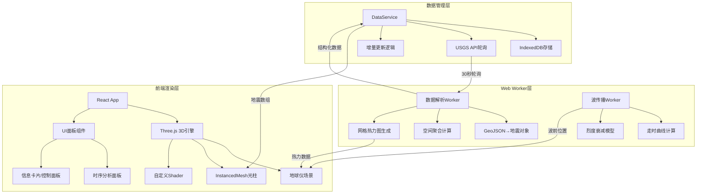
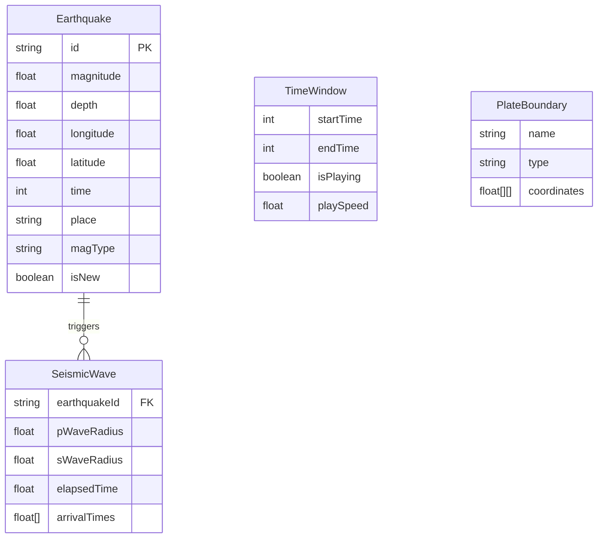

## 1. 架构设计



## 2. 技术说明
- 前端框架：React 18 + TypeScript + Vite
- 3D渲染：Three.js + @react-three/fiber + @react-three/drei + @react-three/postprocessing
- 地图纹理：Mapbox GL JS（生成卫星底图纹理，非直接嵌入地图组件）
- 样式方案：Tailwind CSS 3
- 数据存储：IndexedDB（idb库封装）
- 后台计算：Web Worker（内联Worker，Vite支持）
- 图表库：自定义Canvas绑定（散点图、直方图），不引入重型图表库
- 初始化工具：Vite
- 后端：无（纯前端，数据来自USGS公开API）
- 数据库：IndexedDB（浏览器本地）

## 3. 路由定义
| 路由 | 用途 |
|------|------|
| / | 主页面，全屏3D地球仪 + 叠加UI面板 |

## 4. API定义（外部数据源）

### 4.1 USGS Earthquake API
```typescript
interface USGSFeature {
  type: "Feature"
  properties: {
    mag: number
    place: string
    time: number
    updated: number
    url: string
    detail: string
    felt: number | null
    cdi: number | null
    mmi: number | null
    alert: string | null
    tsunami: number
    sig: number
    net: string
    code: string
    ids: string
    sources: string
    types: string
    nst: number | null
    dmin: number | null
    rms: number
    gap: number | null
    magType: string
    type: string
    title: string
  }
  geometry: {
    type: "Point"
    coordinates: [number, number, number] // [longitude, latitude, depth_km]
  }
  id: string
}

interface USGSResponse {
  type: "FeatureCollection"
  metadata: {
    generated: number
    url: string
    title: string
    count: number
  }
  features: USGSFeature[]
}

// API端点
const USGS_API = "https://earthquake.usgs.gov/earthquakes/feed/v1.0/summary/all_month.geojson"
```

### 4.2 内部数据模型
```typescript
interface Earthquake {
  id: string
  magnitude: number
  depth: number         // km
  longitude: number
  latitude: number
  time: number          // timestamp ms
  place: string
  magType: string
  type: string          // "earthquake" | "quarry" | ...
  significance: number
  tsunami: boolean
  felt: number | null
  cdi: number | null
  mmi: number | null
  isNew: boolean        // 本次轮询新增标记
  color: [number, number, number]  // 计算后的RGB
  pillarHeight: number  // 光柱高度
}
```

## 5. 服务器架构图
无后端服务器，纯前端应用。数据直接从USGS公开API获取。

## 6. 数据模型

### 6.1 数据模型定义


### 6.2 IndexedDB Schema
```typescript
// Database: EarthquakeDB v1
const DB_NAME = "EarthquakeDB"
const DB_VERSION = 1

// Object Store: earthquakes
// Key Path: id
// Indexes:
//   - time (non-unique): 按时间范围查询
//   - magnitude (non-unique): 按震级筛选
//   - depth (non-unique): 按深度筛选
//   - significance (non-unique): 按重要性排序

interface EarthquakeRecord {
  id: string
  magnitude: number
  depth: number
  longitude: number
  latitude: number
  time: number
  place: string
  magType: string
  type: string
  significance: number
  tsunami: number
  felt: number | null
  cdi: number | null
  mmi: number | null
  isNew: number  // 0 | 1 for IndexedDB boolean
  lastUpdated: number
}
```

## 7. 关键技术策略

### 7.1 三维渲染优化
- **InstancedMesh**：所有地震光柱共享一个几何体，通过实例矩阵和颜色属性批量渲染，每帧仅更新变化实例
- **自定义Shader**：顶点Shader控制光柱高度和脉冲缩放，片段Shader实现颜色渐变和发光效果
- **LOD策略**：根据相机距离动态调整光柱细节，远处只渲染点精灵，近处渲染完整光柱
- **视锥剔除**：仅渲染相机可见半球上的地震事件
- **后处理Bloom**：UnrealBloomPass增强发光效果，阈值0.8确保只有光柱和边缘发光

### 7.2 数据流优化
- **Web Worker**：USGS数据获取和解析在Worker中完成，主线程仅接收结构化结果
- **增量更新**：对比已有数据ID，仅处理新增地震事件
- **IndexedDB**：支持离线浏览，启动时优先从本地缓存加载，后台静默更新
- **requestAnimationFrame限流**：时间轴拖拽和数据更新与渲染帧同步

### 7.3 地震波传播模拟算法
- **P波速度**：6.0 km/s（地壳平均）
- **S波速度**：3.5 km/s（地壳平均）
- **波前计算**：Δt = distance / velocity，每帧更新波前半径
- **烈度衰减**：采用简化的Boore-Atkinson模型，MMI = c1 + c2*M - c3*log10(R) - c4*R
- **同心圆渲染**：使用自定义Ring几何体+Shader，随时间向外扩展并淡出

### 7.4 震源机制海滩球
- 使用自定义球面投影绘制压缩区和膨胀区
- 根据震源参数（strike, dip, rake）计算投影
- 以半透明纹理贴图形式覆盖在地球表面
