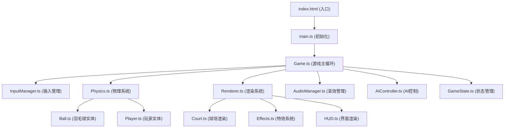

## 1. 架构设计



## 2. 技术描述

- **前端技术栈**：TypeScript 5 + Vite 5 + Canvas 2D API
- **初始化工具**：Vite vanilla-ts 模板
- **后端**：无（纯前端游戏）
- **数据库**：无（游戏进度存储在 localStorage）
- **CSS方案**：原生CSS + CSS变量

### 核心依赖
- `typescript` - 类型系统
- `vite` - 构建工具和开发服务器
- 无额外第三方库，所有游戏逻辑和渲染均原生实现

## 3. 目录结构

```
badminton/
├── src/
│   ├── main.ts              # 游戏入口
│   ├── Game.ts              # 游戏主控制器
│   ├── types.ts             # 类型定义
│   ├── constants.ts         # 游戏常量
│   ├── core/
│   │   ├── GameState.ts     # 游戏状态管理
│   │   ├── InputManager.ts  # 键盘输入管理
│   │   └── AudioManager.ts  # Web Audio API音效
│   ├── entities/
│   │   ├── Player.ts        # 玩家实体
│   │   ├── Ball.ts          # 羽毛球实体
│   │   └── AIController.ts  # AI对手逻辑
│   ├── physics/
│   │   └── Physics.ts       # 物理引擎
│   └── rendering/
│       ├── Renderer.ts      # 主渲染器
│       ├── Court.ts         # 球场渲染
│       ├── Effects.ts       # 特效系统
│       └── HUD.ts           # 界面渲染
├── index.html
├── style.css
├── tsconfig.json
└── vite.config.ts
```

## 4. 核心类型定义

```typescript
// 游戏状态枚举
enum GamePhase {
  MENU = 'menu',
  PLAYING = 'playing',
  SCORE = 'score',
  GAME_OVER = 'game_over'
}

// 击球类型
enum ShotType {
  CLEAR = 'clear',       // 挑高球
  DRIVE = 'drive',       // 平快球
  DROP = 'drop',         // 网前小球
  SMASH = 'smash',       // 扣杀
  SPECIAL = 'special'    // 必杀扣杀
}

// AI风格
enum AIStyle {
  DEFENSIVE = 'defensive',   // 防守型
  AGGRESSIVE = 'aggressive', // 进攻型
  NET = 'net'                // 网前型
}

// 位置接口
interface Vector2 {
  x: number;
  y: number;
}

// 玩家状态
interface PlayerState {
  position: Vector2;
  velocity: Vector2;
  stamina: number;
  isStunned: boolean;
  stunTimer: number;
  isSwinging: boolean;
  swingTimer: number;
  score: number;
  gamesWon: number;
}

// 球状态
interface BallState {
  position: Vector2;
  velocity: Vector2;
  height: number;           // 模拟高度（用于阴影和扣杀）
  isInAir: boolean;
  lastHitBy: 'player' | 'ai' | null;
  shotType: ShotType | null;
  trail: Vector2[];         // 拖尾轨迹
}
```

## 5. 游戏常量

```typescript
// 画布尺寸
const CANVAS_WIDTH = 960;
const CANVAS_HEIGHT = 640;

// 球场尺寸（像素）
const COURT_WIDTH = 800;
const COURT_HEIGHT = 480;
const COURT_X = 80;
const COURT_Y = 80;
const NET_X = COURT_X + COURT_WIDTH / 2;

// 玩家属性
const PLAYER_SPEED = 200;        // 像素/秒
const PLAYER_SIZE = 16;          // 像素
const MAX_STAMINA = 100;
const STAMINA_REGEN = 10;        // 每秒恢复
const SPECIAL_COST = 100;        // 必杀技消耗
const STUN_DURATION = 1.5;       // 硬直时间（秒）

// 羽毛球物理
const GRAVITY = 300;             // 重力加速度
const AIR_RESISTANCE = 0.98;     // 空气阻力
const WIND_STRENGTH = 50;        // 最大风力
const BALL_RADIUS = 4;

// 击球判定
const HIT_RADIUS = 40;           // 击球判定范围
const PERFECT_HIT_WINDOW = 0.15; // 完美击球时机窗口
const GOOD_HIT_WINDOW = 0.3;     // 良好击球时机窗口

// 比赛规则
const POINTS_TO_WIN = 15;
const GAMES_TO_WIN = 2;
```

## 6. 核心算法

### 6.1 羽毛球物理
- 使用简化的抛物线运动模拟
- 风力作为水平加速度，每帧随机微调
- 落地判定：y >= 球场边界 且 height <= 0
- 过网判定：x 穿过 NET_X 且 height > 网高

### 6.2 击球判定系统
```
时机 + 站位 = 回球质量
├── 完美时机 + 到位站位 = 平快球/扣杀
├── 良好时机 + 到位站位 = 普通回球
├── 仓促时机 + 到位站位 = 挑高球
└── 任何时机 + 不到位站位 = 勉强挑高/失误
```

### 6.3 AI决策树
```
AI决策
├── 计算球落点预测
├── 移动到最优位置
└── 击球决策
    ├── 高球 → 扣杀（进攻型）/ 挑高（防守型）
    ├── 网前球 → 放小球（网前型）/ 挑高
    └── 平快球 → 平抽回击
```

### 6.4 渲染管线
```
每帧渲染顺序
1. 球场背景和界线
2. 球网（带飘动动画）
3. 阴影（球和玩家）
4. 玩家角色（先AI后玩家）
5. 羽毛球及其拖尾
6. 特效层（灰尘、星星、残影）
7. HUD层（比分、体力、风向）
8. 裁判小人
```
