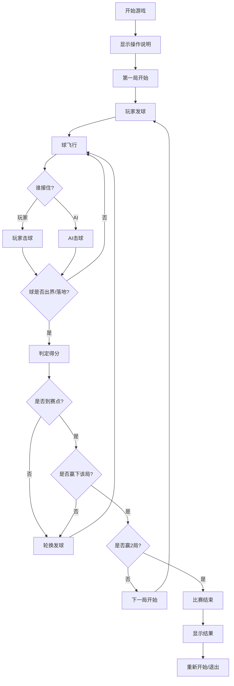

## 1. 产品概述

一款基于Canvas 2D的俯视视角像素风羽毛球对战游戏，玩家操控扎着头带的选手与AI对手进行三局两胜制的羽毛球比赛。

- 核心玩法：通过方向键移动，击球键挥拍，根据时机和站位打出不同质量的回球
- 目标用户：喜欢休闲竞技类游戏的玩家
- 产品价值：提供轻量级、策略性强的像素风体育竞技体验

## 2. 核心功能

### 2.1 用户角色
| 角色 | 注册方式 | 核心权限 |
|------|----------|----------|
| 玩家 | 无需注册 | 操控角色进行比赛，调整游戏设置 |

### 2.2 功能模块
1. **游戏主界面**：开始菜单、比赛场地、比分显示
2. **比赛系统**：三局两胜制、每局15分、轮换发球
3. **玩家控制**：方向键移动、空格键击球、必杀技释放
4. **AI对手**：多种风格（防守型、进攻型、网前型）、难度递增
5. **物理系统**：羽毛球飞行轨迹、风力影响、落地判定
6. **视觉特效**：像素灰尘、星星闪烁、球残影、网飘动
7. **音效系统**：击球音效、得分音效

### 2.3 页面详情
| 页面名称 | 模块名称 | 功能描述 |
|----------|----------|----------|
| 游戏主页面 | 开始菜单 | 显示游戏标题、开始按钮、操作说明 |
| 游戏主页面 | 比赛场地 | Canvas渲染的深绿色球场，白色界线，中间球网 |
| 游戏主页面 | HUD界面 | 比分显示、局分显示、体力槽、当前风向指示 |
| 游戏主页面 | 得分特效 | 场边星星闪烁、裁判举手报分动画 |
| 游戏主页面 | 结算界面 | 显示比赛结果、重新开始按钮 |

## 3. 核心流程

## 4. 用户界面设计

### 4.1 设计风格
- **主色调**：深绿色（#1a4d2e）球场，白色（#ffffff）界线，像素风配色
- **辅助色**：选手服装色（#e74c3c 玩家，#3498db AI），黄色（#f1c40f）羽毛球
- **按钮风格**：像素风矩形按钮，黑色边框，悬停时有高亮效果
- **字体**：像素风格字体（Press Start 2P或类似），标题24px，正文14px
- **布局风格**：居中Canvas画布，HUD信息分布在画布四周
- **像素风格**：所有元素使用像素块绘制，无抗锯齿，保留复古像素美感

### 4.2 页面设计概述
| 页面名称 | 模块名称 | UI元素 |
|----------|----------|--------|
| 游戏主页面 | 开始菜单 | 居中大标题、闪烁开始提示、底部操作说明 |
| 游戏主页面 | 比赛场地 | 深绿色场地、白色界线、飘动球网、像素选手、飞行的羽毛球 |
| 游戏主页面 | HUD界面 | 左上角玩家比分、右上角AI比分、底部体力槽、顶部风向指示器 |
| 游戏主页面 | 得分特效 | 场边闪烁星星、裁判小人举手、得分数字弹跳动画 |
| 游戏主页面 | 结算界面 | 半透明黑色遮罩、居中结果文字、重新开始按钮 |

### 4.3 响应式
- 采用固定像素尺寸Canvas（960x640），桌面端居中显示
- 移动端可等比缩放Canvas，适配触摸操作（虚拟方向键和击球按钮）
- 桌面优先，兼顾移动端体验

### 4.4 像素风细节
- 角色由8x12像素块组成，头带为明显识别特征
- 球场采用2px宽白色线条绘制
- 球为3x3像素的菱形，飞行时有拖尾效果
- 扣杀时球变为5x5像素，带有残影
- 落地灰尘为随机散布的4-6个灰色像素点
