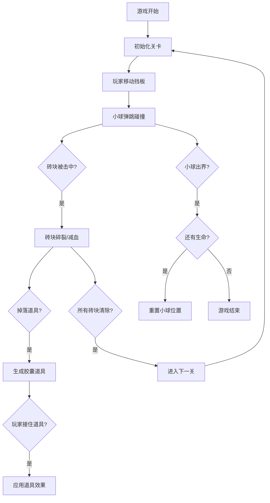

## 1. 产品概述

经典打砖块游戏，玩家通过操控底部挡板接住弹跳的小球，击碎屏幕上方的彩色砖块矩阵。游戏包含多种砖块类型、道具系统和递进关卡，追求极限高分挑战。

## 2. 核心功能

### 2.1 功能模块
1. **游戏主界面**：游戏画布、分数显示、生命值、关卡信息
2. **游戏核心玩法**：小球弹跳、挡板移动、砖块碰撞检测
3. **砖块系统**：普通砖块、银色砖块（2次击碎）、金色砖块（不可摧毁）
4. **道具系统**：蓝色（变长）、红色（变短）、绿色（减速）、黄色（穿透）、紫色（加命）
5. **关卡系统**：多层递进关卡，砖块排布难度递增
6. **游戏状态管理**：开始、暂停、游戏结束、通关

### 2.2 页面详情
| 页面名称 | 模块名称 | 功能描述 |
|---------|---------|----------|
| 游戏主界面 | 游戏画布 | 渲染小球、挡板、砖块、道具动画 |
| 游戏主界面 | 状态栏 | 显示当前分数、生命值、关卡数 |
| 游戏主界面 | 开始/暂停 | 控制游戏开始、暂停、继续 |
| 游戏主界面 | 游戏结束 | 显示最终分数，重新开始选项 |

## 3. 核心流程

## 4. 用户界面设计

### 4.1 设计风格
- **主色调**：深色背景（#0a0a1a）营造霓虹效果
- **砖块颜色**：红、橙、黄、绿、蓝、紫彩虹色系
- **特殊砖块**：银色（渐变金属感）、金色（闪耀效果）
- **小球**：纯白色带发光效果
- **挡板**：青蓝色渐变，带科技感
- **字体**：使用像素风格字体，配合霓虹发光效果
- **布局**：居中游戏画布，顶部状态栏

### 4.2 页面设计概述
| 页面名称 | 模块名称 | UI元素 |
|---------|---------|--------|
| 游戏主界面 | 游戏画布 | 深色星空背景，霓虹砖块，发光小球，动态道具 |
| 游戏主界面 | 状态栏 | 数字显示，发光效果，清晰的信息层级 |
| 游戏主界面 | 开始界面 | 大标题动画，闪烁开始按钮 |
| 游戏主界面 | 游戏结束 | 分数展示，重新开始按钮 |

### 4.3 响应式
- 桌面端：固定尺寸游戏画布，键盘控制（左右方向键）
- 移动端：自适应画布，触摸滑动控制

### 4.4 动画与特效
- 砖块碎裂：粒子爆炸效果
- 道具掉落：闪烁下落动画
- 小球碰撞：发光脉冲效果
- 极限救球：特殊闪光提示
