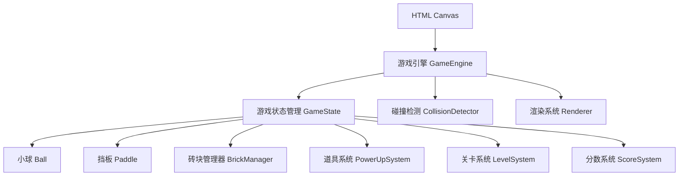

## 1. 架构设计

## 2. 技术描述

- **前端技术栈**：原生 HTML5 Canvas + JavaScript (ES6+)
- **构建工具**：无额外构建工具，纯静态HTML/JS/CSS
- **样式**：CSS3 动画与渐变
- **渲染**：Canvas 2D API，requestAnimationFrame 游戏循环

## 3. 核心类设计

### 3.1 GameEngine
- 游戏主循环管理
- 输入事件处理
- 游戏状态控制（开始/暂停/结束）

### 3.2 Ball
- 位置、速度、半径属性
- 移动、反弹方法
- 发光效果渲染

### 3.3 Paddle
- 位置、宽度、高度属性
- 左右移动控制
- 极限救球检测

### 3.4 Brick
- 位置、颜色、类型（普通/银色/金色）
- 生命值管理
- 碎裂动画触发

### 3.5 PowerUp
- 类型（蓝/红/绿/黄/紫）
- 下落动画
- 效果应用逻辑

### 3.6 LevelSystem
- 关卡配置数据
- 砖块布局生成
- 难度递增控制

## 4. 碰撞检测算法

- **小球-砖块**：AABB 碰撞检测 + 反弹角度计算
- **小球-挡板**：基于碰撞位置的角度偏转（极限救球）
- **道具-挡板**：简单矩形碰撞

## 5. 性能优化

- requestAnimationFrame 实现 60fps 游戏循环
- 对象池复用减少 GC
- 离屏渲染砖块纹理
