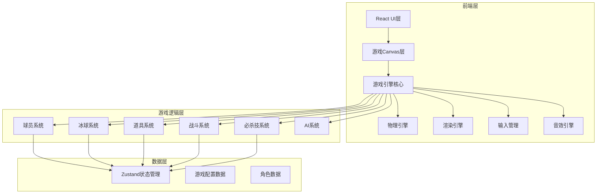

## 1. 架构设计



## 2. 技术说明
- **前端框架**：React@18 + TypeScript + Vite
- **游戏渲染**：HTML5 Canvas 2D（自定义游戏引擎）
- **样式方案**：Tailwind CSS（UI层）+ Canvas渲染（游戏层）
- **状态管理**：Zustand（游戏状态、比分、菜单状态）
- **物理引擎**：自研轻量冰面物理系统（惯性、摩擦、碰撞）
- **动画**：Canvas帧动画 + CSS动画（UI层）
- **初始化工具**：vite-init react-ts模板
- **后端**：无（纯前端游戏）
- **数据库**：无（游戏状态全部内存管理）

## 3. 路由定义
| 路由 | 用途 |
|------|------|
| / | 主菜单页面，游戏标题和菜单选项 |
| /game | 比赛页面，全屏Canvas游戏 |
| /result | 结果页面，比分和MVP展示 |

## 4. 游戏引擎架构

### 4.1 核心模块

| 模块 | 职责 |
|------|------|
| GameEngine | 游戏主循环，帧率控制，场景管理 |
| PhysicsEngine | 冰面摩擦、惯性、碰撞检测、弹性反弹 |
| Renderer | Canvas2D渲染，像素风绘制，特效渲染 |
| InputManager | 双人键盘输入映射，按键状态追踪 |
| AudioManager | 音效播放（冰刀声、碰撞声、进球声） |
| ParticleSystem | 粒子特效（冰屑、火花、纸屑） |

### 4.2 游戏对象

| 对象 | 属性 |
|------|------|
| Player | 位置、速度、朝向、队伍、角色类型、血量、蓄力值、状态（正常/倒地/冻结/麻痹） |
| Puck | 位置、速度、旋转、持有者、状态（正常/火球/分裂/弧线） |
| Item | 位置、类型、生效时长 |
| Goal | 位置、队伍、碰撞区域 |
| Rink | 挡板碰撞区域、球门位置、中线、争球圈 |

### 4.3 球员类型与属性

| 角色 | 速度 | 力量 | 射门 | 传球 | 必杀技 |
|------|------|------|------|------|--------|
| 前锋（突击型） | ★★★★★ | ★★ | ★★★★ | ★★★ | 火焰射门（球速极快变火球） |
| 前锋（技巧型） | ★★★★ | ★★ | ★★★ | ★★★★★ | 分裂射门（球分裂为三） |
| 前锋（力量型） | ★★★ | ★★★★★ | ★★★★ | ★★ | 弧线射门（球空中划弧线） |
| 后卫（防守型） | ★★★ | ★★★★ | ★★ | ★★★ | 冰墙（滑铲形成冰墙） |
| 后卫（抢断型） | ★★★★ | ★★★ | ★★★ | ★★★★ | 旋风铲（360度滑铲清场） |
| 守门员 | ★★ | ★★★★ | ★ | ★★ | 分身扑救（分身两个同时扑左右） |

### 4.4 连携必杀

| 连携组合 | 效果 |
|----------|------|
| 技巧型前锋 + 突击型前锋 | 旋转传球 → 凌空抽射，球带旋风卷开沿路所有人 |
| 力量型前锋 + 防守型后卫 | 重炮传球 → 撞墙反弹射门 |

### 4.5 道具系统

| 道具 | 效果 | 持续时间 |
|------|------|----------|
| 加速冰刀 | 移动速度x1.8，但更难刹车 | 8秒 |
| 加长球杆 | 抢断范围增大50% | 10秒 |
| 冰冻球 | 冻住触碰对手3秒 | 即时 |
| 电击球 | 击中对手麻痹1.5秒 | 即时 |

### 4.6 冰面物理参数

| 参数 | 值 | 说明 |
|------|-----|------|
| 冰面摩擦系数 | 0.02 | 极低摩擦，模拟冰面滑行 |
| 加速度 | 0.8 | 球员推力 |
| 最大速度 | 6.0 | 普通最大速度 |
| 刹车摩擦 | 0.08 | 主动刹车时的额外摩擦 |
| 转向衰减 | 0.7 | 高速时转向效果降低 |
| 碰撞弹性 | 0.6 | 球员间碰撞弹性系数 |
| 挡板弹性 | 0.8 | 撞挡板弹性系数 |
| 冰球摩擦 | 0.005 | 冰球摩擦极低 |

## 5. 操作键位

| 操作 | 玩家1（红队） | 玩家2（蓝队） |
|------|---------------|---------------|
| 移动 | W/A/S/D | ↑/←/↓/→ |
| 传球/切换球员 | Q | Numpad 0 |
| 射门/抢断 | E | Numpad Enter |
| 打架/冲撞 | Space | Right Shift |
| 必杀技（蓄力释放） | R | Numpad . |
| 使用道具 | F | Numpad + |

## 6. 项目文件结构

```
src/
├── components/          # React UI组件
│   ├── Menu.tsx         # 主菜单
│   ├── HUD.tsx          # 游戏内HUD
│   └── ResultScreen.tsx # 结果页面
├── game/                # 游戏引擎核心
│   ├── engine.ts        # 游戏主循环
│   ├── physics.ts       # 冰面物理引擎
│   ├── renderer.ts      # Canvas渲染器
│   ├── input.ts         # 输入管理
│   ├── particles.ts     # 粒子系统
│   └── audio.ts         # 音效管理
├── entities/            # 游戏实体
│   ├── player.ts        # 球员类
│   ├── puck.ts          # 冰球类
│   ├── item.ts          # 道具类
│   └── rink.ts          # 冰球场类
├── systems/             # 游戏系统
│   ├── ai.ts            # AI系统
│   ├── combat.ts        # 战斗系统
│   ├── special.ts       # 必杀技系统
│   └── items.ts         # 道具系统
├── data/                # 游戏数据
│   ├── players.ts       # 球员属性数据
│   ├── specials.ts      # 必杀技数据
│   └── config.ts        # 游戏配置
├── store/               # 状态管理
│   └── gameStore.ts     # Zustand游戏状态
├── pages/               # 页面
│   ├── Home.tsx         # 主菜单页
│   ├── Game.tsx         # 比赛页
│   └── Result.tsx       # 结果页
├── utils/               # 工具函数
│   └── helpers.ts
├── App.tsx
└── main.tsx
```
