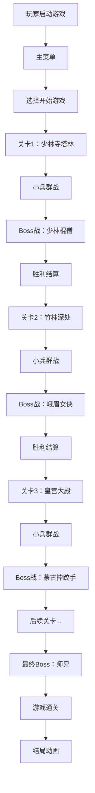

## 1. 产品概述
《功夫小子》是一款东方武术题材的横版动作闯关游戏，玩家操控一名少年武者，赤手空拳挑战各路高手，目标是击败最终Boss为师门正名。

- 核心玩法：拳脚组合战斗系统，包含拳、脚、连击、必杀技等丰富招式
- 目标用户：喜欢横版动作游戏、武术题材的玩家
- 市场价值：融合像素美学与深度战斗系统，打造沉浸式武术格斗体验

## 2. 核心功能

### 2.1 功能模块
1. **游戏主菜单**：开始游戏、操作说明、关于游戏
2. **战斗场景**：玩家控制、敌人AI、碰撞检测、战斗逻辑
3. **关卡系统**：6个主题关卡，每关含小兵群战和Boss战
4. **角色系统**：玩家角色、敌人、Boss的属性和状态管理
5. **招式系统**：基础攻击、方向招式、必杀技、连击系统
6. **气力系统**：连击累积气力，气满释放必杀技
7. **UI系统**：血量条、气力槽、连击数、Boss血条
8. **道具系统**：馒头回血、茶水回气、铜钱加分
9. **特效系统**：残影、屏幕震动、黑白特效、发光效果
10. **音效系统**：背景音乐、打击音效、必杀音效

### 2.2 页面详情
| 页面名称 | 模块名称 | 功能描述 |
|-----------|-------------|---------------------|
| 主菜单 | 标题画面 | 游戏logo、开始按钮、操作说明、像素风格背景 |
| 战斗界面 | HUD | 血量条、气力槽、连击计数器、得分显示 |
| 战斗界面 | 场景渲染 | 多图层背景、可交互元素、粒子效果 |
| 战斗界面 | 角色渲染 | 像素角色动画、攻击帧、受击帧、残影效果 |
| Boss战 | 登场动画 | 黑边遮罩、Boss名称条幅、特写镜头 |
| 结算界面 | 胜利/失败 | 战斗统计、道具获得、下一关/重试按钮 |

## 3. 核心流程

## 4. 关卡与Boss设计

### 4.1 关卡设计
| 关卡 | 场景 | 特色机制 | Boss |
|------|------|----------|------|
| 1 | 少林寺塔林 | 可踢倒石柱砸敌人 | 少林棍僧 |
| 2 | 竹林深处 | 砍断竹子形成障碍 | 峨眉女侠 |
| 3 | 瀑布山崖 | 湿滑地面滑步变长 | 蒙古摔跤手 |
| 4 | 暗夜庭院 | 双截棍快速攻击 | 忍者 |
| 5 | 道观密室 | 气功远程攻击 | 老拳师 |
| 6 | 金銮大殿 | 镜像对决 | 师兄（最终Boss） |

### 4.2 Boss战斗风格
1. **少林棍僧**：长棍攻击距离远但收招慢，需要近身缠斗
2. **峨眉女侠**：身形灵活会闪避和飞镖暗器，扫堂腿逼起跳再空中截击
3. **蒙古摔跤手**：霸体状态不怕普通攻击，必须用必杀技打退
4. **忍者**：双截棍快速连击，会隐身偷袭
5. **老拳师**：气功远程攻击，需要近身
6. **师兄**：招式和玩家一模一样，拼反应和格挡

## 5. 战斗系统设计

### 5.1 基础操作
- **方向键**：移动、跳跃、下蹲
- **J键**：拳攻击（出手快、伤害低、适合连击）
- **K键**：脚攻击（前摇慢、伤害高、可踢退）
- **L键**：必杀技（气力满时可用）
- **空格**：跳跃

### 5.2 招式组合
| 招式 | 操作 | 效果 |
|------|------|------|
| 前冲拳 | → + J | 快速突进攻击 |
| 上勾拳 | ↑ + J | 上挑攻击，可击飞 |
| 扫堂腿 | ↓ + K | 下段攻击，可绊倒 |
| 飞踢 | 空中 + K | 空中俯冲攻击 |
| 幻影连击 | L（气满） | 瞬间突进多段连击 |
| 气功波 | ↓ + L（气满） | 原地蓄力释放清屏 |

### 5.3 战斗机制
- **连击系统**：连续命中累积连击数，提升伤害和气力获取
- **气力系统**：连击和命中敌人累积气力，满值100
- **硬直系统**：攻击和被击中有硬直时间，抓住破绽出招
- **格挡系统**：敌人会格挡正面攻击，需要绕后或使用下段攻击
- **霸体系统**：部分Boss有霸体，普通攻击无法打断

## 6. 用户界面设计

### 6.1 设计风格
- **主色调**：中国红 (#C41E3A)、墨黑 (#1A1A1A)、古金 (#D4AF37)
- **像素风格**：16x16像素角色，低分辨率复古美学
- **字体**：像素风格字体，搭配书法字体用于标题
- **布局**：HUD位于屏幕四角，不遮挡战斗区域
- **特效**：复古CRT扫描线效果、像素颗粒感

### 6.2 页面设计
| 页面 | 模块 | UI元素 |
|------|------|--------|
| 主菜单 | 标题 | 像素书法logo、飘落樱花动画、灯笼摆动 |
| 战斗界面 | HUD左上角 | 玩家头像、血量条（红色）、气力槽（金色） |
| 战斗界面 | HUD右上角 | 连击数、得分、关卡名称 |
| 战斗界面 | HUD底部 | Boss血条（出现Boss时显示） |
| Boss登场 | 过场 | 上下黑边、Boss名称条幅、慢镜头 |
| 必杀特效 | 全屏 | 短暂黑白、速度线、闪光、残影 |

### 6.3 响应式设计
- 桌面端：键盘操作，固定1280x720分辨率
- 移动端：虚拟摇杆和按键（可选支持）
- 自适应：Canvas等比缩放，保持像素清晰度

## 7. 视觉特效设计
- **残影效果**：快速移动和攻击时产生半透明残影
- **屏幕震动**：被击中或使用强力攻击时震动
- **受击闪白**：角色被击中时短暂变白
- **气力发光**：气力满时角色身体发出金色光芒
- **必杀黑白**：释放必杀时屏幕短暂黑白然后恢复色彩
- **速度线**：快速移动和突进时的动态线条
- **粒子效果**：打击火花、樱花飘落、尘土飞扬

## 8. 音效设计
- **背景音乐**：民乐+摇滚节奏，每关风格配合Boss流派
- **打击音效**：拳脚命中的沉闷打击声
- **必杀音效**：风声+清亮的音效
- **场景音效**：竹林风声、瀑布水声、寺庙钟声
- **语音**：角色出招喊喝声、Boss胜利台词
