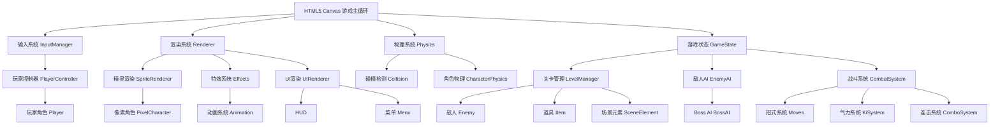

## 1. 架构设计



## 2. 技术选型

- **前端框架**：原生 JavaScript + HTML5 Canvas 2D
- **构建工具**：Vite
- **语言**：JavaScript (ES6+)
- **样式**：CSS3 + TailwindCSS 3
- **音频**：Web Audio API
- **像素渲染**：Canvas ImageData / 离屏Canvas
- **状态管理**：有限状态机 (FSM)

## 3. 项目结构

```
src/
├── game/
│   ├── core/
│   │   ├── Game.js          # 游戏主循环
│   │   ├── Input.js         # 输入管理
│   │   ├── Renderer.js        # 渲染器
│   │   ├── Physics.js       # 物理系统
│   │   └── StateMachine.js # 状态机
│   ├── entities/
│   │   ├── Character.js     # 角色基类
│   │   ├── Player.js        # 玩家角色
│   │   ├── Enemy.js         # 敌人基类
│   │   ├── Boss.js          # Boss基类
│   │   ├── Projectile.js      # 投射物
│   │   └── Item.js         # 道具
│   ├── combat/
│   │   ├── CombatSystem.js  # 战斗系统
│   │   ├── Moves.js         # 招式定义
│   │   ├── ComboSystem.js  # 连击系统
│   │   └── KiSystem.js    # 气力系统
│   │   └── Hitbox.js       # 攻击判定
│   ├── levels/
│   │   ├── Level.js         # 关卡基类
│   │   ├── Level1.js        # 少林寺塔林
│   │   ├── Level2.js        # 竹林深处
│   │   ├── Level3.js        # 瀑布山崖
│   │   ├── Level4.js        # 暗夜庭院
│   │   ├── Level5.js        # 道观密室
│   │   └── Level6.js        # 金銮大殿
│   ├── ai/
│   │   ├── EnemyAI.js       # 敌人AI
│   │   └── BossAI.js        # Boss AI
│   │   └── Patterns.js      # 攻击模式
│   ├── effects/
│   │   ├── Effects.js       # 特效系统
│   │   ├── Particles.js     # 粒子系统
│   │   └── ScreenShake.js   # 屏幕震动
│   │   └── AfterImage.js   # 残影效果
│   ├── audio/
│   │   ├── AudioManager.js  # 音频管理
│   │   ├── SoundEffects.js # 音效
│   │   └── BGM.js         # 背景音乐
│   └── ui/
│       ├── HUD.js             # 血条气力槽
│       ├── Menu.js            # 主菜单
│       └── UI.js              # UI组件
│       └── Transition.js      # 过场动画
├── assets/
│   ├── sprites/             # 精灵图（程序生成）
│   └── sounds/              # 音效（程序生成）
├── styles/
│   └── main.css
├── main.js
└── index.html
```

## 4. 核心类定义

### 4.1 游戏主循环
```javascript
class Game {
  constructor()
  init()
  update(dt)      // 更新游戏逻辑
  render(ctx)    // 渲染画面
  loop()         // 主循环
}
```

### 4.2 角色基类
```javascript
class Character {
  x, y, width, height
  velocityX, velocityY
  health, maxHealth
  state: 'idle'|'walk'|'attack'|'hurt'|'block'|'dead'
  facing: 1 | -1
  isGrounded: boolean
  superArmor: boolean  // 霸体
  hitbox: Rect
  update(dt)
  render(ctx)
  takeDamage(damage, knockback)
}
```

### 4.3 战斗系统
```javascript
class CombatSystem {
  checkHit(attacker, defender)
  applyDamage(attacker, defender, move)
  addCombo(attacker)
  buildKi(attacker, amount)
}
```

### 4.4 招式定义
```javascript
const Moves = {
  PUNCH: { damage: 8, startup: 5, active: 3, recovery: 8, knockback: 2, kiGain: 5 },
  KICK: { damage: 15, startup: 12, active: 4, recovery: 15, knockback: 8, kiGain: 10 },
  DASH_PUNCH: { damage: 12, startup: 8, active: 4, recovery: 12, knockback: 5, kiGain: 8 },
  UPPERCUT: { damage: 18, startup: 10, active: 5, recovery: 20, knockback: 10, kiGain: 12 },
  SWEEP: { damage: 14, startup: 8, active: 6, recovery: 18, knockback: 3, kiGain: 10 },
  FLYING_KICK: { damage: 20, startup: 6, active: 8, recovery: 25, knockback: 12, kiGain: 15 },
  ULTIMATE_COMBO: { damage: 50, startup: 15, active: 30, recovery: 60, knockback: 20, kiCost: 100 },
  QI_WAVE: { damage: 40, startup: 30, active: 10, recovery: 40, knockback: 30, kiCost: 100 }
}
```

## 5. 渲染系统

### 5.1 像素渲染
- 使用 Canvas 2D API
- 程序生成像素精灵
- 离屏Canvas预渲染角色
- 像素完美碰撞检测
- CRT扫描线后处理

### 5.2 动画系统
- 帧动画（每帧8-12帧
- 状态驱动动画
- 动作帧插值
- 攻击帧判定

### 5.3 特效系统
- 残影：保存最近5帧位置
- 粒子：打击火花、樱花、尘土
- 屏幕震动：根据攻击强度震动
- 黑白特效：必杀时短暂灰度渲染

## 6. 物理系统

### 6.1 碰撞检测
- AABB碰撞检测
- 分离轴定理(SAT)
- 地面检测
- 攻击判定盒

### 6.2 角色物理
- 重力：0.8像素/帧²
- 移动速度：4像素/帧
- 跳跃力：-14像素/帧
- 击退：根据攻击强度

## 7. 状态管理

### 7.1 游戏状态
```javascript
const GameStates = {
  MENU: 'menu',
  PLAYING: 'playing',
  PAUSED: 'paused',
  BOSS_INTRO: 'boss_intro',
  VICTORY: 'victory',
  DEFEAT: 'defeat',
  TRANSITION: 'transition'
}
```

### 7.2 角色状态
```javascript
const CharacterStates = {
  IDLE: 'idle',
  WALK: 'walk',
  JUMP: 'jump',
  CROUCH: 'crouch',
  PUNCH: 'punch',
  KICK: 'kick',
  SPECIAL: 'special',
  HURT: 'hurt',
  BLOCK: 'block',
  DEAD: 'dead'
}
```

## 8. 关卡数据结构

```javascript
class Level {
  backgroundLayers: []      // 背景图层
  platforms: []       // 平台
  enemies: []          // 敌人生成点
  interactables: []     // 可交互元素
  boss: Boss           // Boss
  items: []          // 道具
  update(dt)
  renderBackground(ctx)
  spawnEnemies()
  checkVictory()
}
```

## 9. 性能优化

- 对象池：粒子和攻击判定
- 视口剔除：只渲染屏幕内
- 离屏渲染：静态背景
- 帧率控制：60fps固定
- 内存管理：及时清理特效

## 10. 输入映射

| 按键 | 功能 |
|------|------|
| ArrowLeft / A | 左移 |
| ArrowRight / D | 右移 |
| ArrowUp / W | 跳跃 |
| ArrowDown / S | 下蹲 |
| J | 拳攻击 |
| K | 脚攻击 |
| L | 必杀技 |
| Space | 跳跃 |
| Enter | 确认/开始 |
| Esc | 暂停 |

